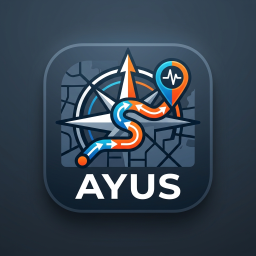

<table>
  <tr>
    <td width="76"></td>
    <td><h1>A.Y.U.S.</h1></td>
  </tr>
</table>

Görüntü tabanlı göreli risk haritası çıkaran ve geçilebilir alanlar üzerinden rota öneren, TUA Astro Hackathon için geliştirilmiş bir afet rota planlama prototipi.

> **Uyarı:** Bu uygulama gerçek acil durum yönetimi veya navigasyon sistemi değildir. Resmî kurumların talimatları her zaman önceliklidir.

## Hızlı başlangıç

Depoyu indirin:

```bash
git clone https://github.com/beratbesli/A.Y.U.S..git
cd A.Y.U.S.
```

**Windows:** `kurulum.bat` dosyasını, ardından `baslat.bat` dosyasını çalıştırın.

**Linux:**

```bash
./kurulum.sh
./baslat.sh
```

Uygulamada görüntüyü seçip **Rota oluştur** düğmesine basın. Üretilen rota ve risk haritası seçilen çıktı klasörüne kaydedilir.

## Komut satırı

```bash
python -m ayus --input depremfoto.png --output-dir outputs
```

Kalibrasyon dosyası kullanmak için:

```bash
python kalibrasyon.py --input depremfoto.png --output-config ayus_config.json
python -m ayus --config ayus_config.json
```

## Paketleme ve test

- Windows paketi: `paketle.bat`
- Linux `.deb` ve AppImage paketi: `./paketle.sh`

```bash
python -m pytest -q
python -m ruff check .
```

## Lisans

[MIT Lisansı](LICENSE)
